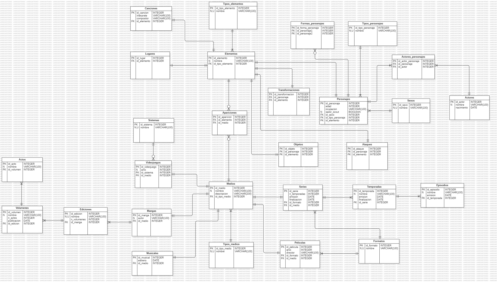

# FAN PAGE SAILOR MOON

## Tabla de contenido
| Índice | Título  |
|--|--|
| 1. | [Descripción](#descripcion-del-proyecto) |
| 2. | [Requisitos del sistema](#requisitos-del-sistema) |
| 3. | [Tablas principales](#tablas-principales) |
| 4. | [Tablas secundarias](#tablas-secundarias) |
| 5. | [Esquema DDL, DML  Y  DQL](#esquema-ddl-y-dml) |
| 6. | [Estructura de la base de datos](#estructura-de-la-base-de-datos) |
| 7. | [Diagrama ER](#diagrama-er) |
| 8. | [Instalación y uso](#instalacion-y-uso) |
| 9. | [Archivos](#archivos) |
| 10. | [Autores](#autores) |

## Descripción del proyecto
Este proyecto tiene como objetivo diseñar y crear una base de datos relacional que capture y gestione información sobre diversos aspectos del universo de *Sailor Moon*. Está pensado para ser utilizado en una fan page, proporcionando una estructura clara y eficiente para almacenar y consultar datos relacionados con películas, series, mangas, personajes, transformaciones, ataques, videojuegos, actores y más. La base de datos también manejará relaciones complejas entre estos elementos a través de tablas secundarias.

## Requisitos del sistema
- **Base de datos**: MySQL (recomendado) u otro sistema de gestión de bases de datos relacionales.
- **Lenguaje**: SQL para la definición y manipulación de los datos.
- **Herramientas adicionales**: Recomendable utilizar herramientas como MySQL Workbench para la gestión y el diseño visual de la base de datos.

## Tablas principales

### Películas
Almacena información sobre las películas de *Sailor Moon*.
- `nombre`: Nombre de la película.
- `descripción`: Descripción de la trama.
- `año`: Año de lanzamiento.
- `director`: Nombre del director.
- `id_formato`: Clave foránea que referencia el formato de la película.

### Series
Contiene información sobre las series de *Sailor Moon* (anime o live-action).
- `nombre`: Nombre de la serie.
- `descripción`: Descripción de la trama.
- `n_temporadas`: Número de temporadas que tiene la serie.

### Mangas
Almacena información relacionada con los mangas de *Sailor Moon*.
- `nombre`: Nombre del manga.
- `descripción`: Descripción de la trama.
- `autor`: Autor del manga.

### Musicales
Registra datos sobre los musicales basados en *Sailor Moon*.
- `nombre`: Nombre del musical.
- `trama`: Breve descripción de la trama.
- `año`: Año del musical.

### Personajes
Contiene los datos de los personajes que aparecen en *Sailor Moon*.
- `nombre`: Nombre del personaje.
- `edad`: Edad del personaje.
- `sexo`: Sexo del personaje.
- `ocupación`: Ocupación del personaje.
- `tipo_personaje`: Clave foránea que define si el personaje es protagonista, antagonista o secundario.
- `sailor_scouts`: Booleano que indica si el personaje es una Sailor Scout.

### Videojuegos
Almacena información sobre los videojuegos de *Sailor Moon*.
- `nombre`: Nombre del videojuego.
- `año_publicacion`: Año de publicación.
- `sistema`: Clave foránea que referencia las plataformas en las que está disponible el juego.

### Actores
Almacena datos de los actores que han participado en las diferentes producciones de *Sailor Moon*.
- `nombre`: Nombre del actor.
- `nacionalidad`: Nacionalidad del actor.
- `fecha_nacimiento`: Fecha de nacimiento del actor.

### Transformaciones
Registra información sobre las transformaciones de los personajes, vinculadas a la tabla de Personajes.
- `nombre`: Nombre de la transformación.
- `personaje`: Clave foránea que referencia al personaje.

### Ataques
Contiene información sobre los ataques utilizados por los personajes, también vinculados a la tabla de Personajes.
- `nombre`: Nombre del ataque.
- `personaje`: Clave foránea que referencia al personaje.

### Elementos
Registra los elementos del universo de Sailor Moon (personajes, objetos, lugares, canciones, transformaciones y ataques).
- `nombre`: Nombre del elemento.

### Medios
Almacena los diferentes medios en los que aparecen los elementos (películas, series, videojuegos, mangas, musicales).
- `nombre`: Nombre del medio.

## Tablas secundarias

### Actor_personaje
Relaciona a los actores con los personajes que interpretan.
- `id_personaje`: Clave foránea que referencia a un personaje.
- `id_actor`: Clave foránea que referencia a un actor.

### Canciones
Almacena datos sobre las canciones presentes en series, películas o musicales.
- `nombre`: Nombre de la canción.
- `interprete`: Persona que interpreta la canción.
- `compositor`: Persona que compuso la canción.

### Temporadas
Registra detalles de las temporadas de las series, vinculadas a la tabla de Series.
- `nombre`: Nombre de la temporada.
- `n_episodios`: Número de episodios de la temporada.
- `fecha_emision`: Fecha de inicio de la emisión.
- `fecha_finalizacion`: Fecha en la que terminó la temporada.
- `serie`: Clave foránea que referencia a la serie.

### Episodios
Contiene información sobre los episodios de la serie, relacionados con la tabla Temporadas.
- `nombre`: Nombre del episodio.
- `fecha_emision`: Fecha de emisión del episodio.
- `temporada`: Clave foránea que referencia a la temporada.

### Tipo_personaje
Define el tipo de personaje (protagonista, antagonista o secundario), vinculado a la tabla de Personajes.
- `nombre`: Tipo de personaje (por ejemplo, protagonista, antagonista).

### Ediciones
Almacena información sobre las ediciones de los mangas, relacionada con la tabla Mangas.
- `manga`: Clave foránea que referencia al manga.
- `nombre`: Nombre de la edición.
- `n_volumenes`: Número de volúmenes que contiene la edición.

### Volúmenes
Contiene información sobre los volúmenes pertenecientes a una edición, relacionados con la tabla Ediciones.
- `edicion`: Clave foránea que referencia a la edición.
- `nombre`: Nombre del volumen.
- `n_actos`: Número de actos que contiene el volumen.
- `año`: Año de publicación del volumen.

### Actos
Registra detalles de los actos dentro de los volúmenes, vinculados a la tabla Volúmenes.
- `nombre`: Nombre del acto.
- `volumen`: Clave foránea que referencia al volumen.

### Objetos
Almacena información sobre los objetos importantes dentro del universo de *Sailor Moon*.
- `nombre`: Nombre del objeto.

### Lugares
Contiene detalles sobre los lugares que aparecen en el universo de *Sailor Moon*.
- `nombre`: Nombre del lugar.

### Sistemas
Almacena las plataformas de los videojuegos.
- `nombre`: Nombre de la plataforma (PlayStation, Nintendo, etc.).

### Apariciones
Registra las apariciones de personajes, objetos, lugares, canciones, transformaciones y ataques en cada medio.
- `id_elemento`: Clave foránea que referencia a un elemento (personaje, objeto, lugar, etc.).
- `id_tipo_elemento`: Clave foránea que referencia al tipo de elemento.
- `id_medio`: Clave foránea que referencia al medio (película, serie, videojuego, manga, musical).
- `id_tipo_medio`: Clave foránea que referencia al tipo de medio.

### Tipos_elementos
Define los distintos tipos de elementos (personaje, objeto, lugar, etc.).
- `nombre`: Nombre del tipo de elemento.

### Tipos_medios
Define los distintos tipos de medios en los que aparecen los elementos (película, serie, videojuego, manga, musical).
- `nombre`: Nombre del tipo de medio.

### Formato
Define los formatos de las películas.
- `nombre`: Nombre del formato (DVD, Blu-Ray, etc.).

## Esquema DDL y DML
- El archivo `ddl.sql` contiene las sentencias SQL para crear las tablas principales y secundarias mencionadas anteriormente.
- El archivo `dml.sql` incluye sentencias de inserción de datos en estas tablas, incluyendo personajes, episodios, películas y más.
- El archivo `dql.sql` incluye sentencias de consulta de datos en las diferentes tablas.

## Lista de Consultas

### Consultas sobre Personajes

1. **Listar todos los personajes con sus ocupaciones**  
   Esta consulta devuelve todos los personajes, junto con su ocupación o rol dentro del universo de Sailor Moon.

2. **Contar el número total de personajes que aparecen en cada serie**  
   Permite conocer cuántos personajes diferentes han aparecido en cada serie del universo de Sailor Moon.

3. **Listar todos los personajes y las series en las que aparecen**  
   Relaciona a cada personaje con las series en las que ha tenido apariciones, permitiendo un análisis cruzado de personajes entre series.

4. **Obtener el nombre de los personajes que aparecen tanto en series como en películas**  
   Filtra los personajes que han hecho apariciones tanto en las series de televisión como en las películas.

5. **Listar todos los personajes que tienen más de un objeto asociado**  
   Muestra aquellos personajes que poseen múltiples objetos dentro del universo de Sailor Moon.

6. **Obtener todos los personajes que aparecen en al menos una transformación y un ataque**  
   Selecciona personajes que han realizado transformaciones y que también han realizado ataques.

7. **Mostrar todos los personajes que aparecen en más de dos videojuegos**  
   Identifica personajes que han tenido múltiples apariciones en los videojuegos del universo de Sailor Moon.

8. **Obtener todos los personajes y la cantidad de ataques que tienen**  
   Devuelve una lista de personajes y la cantidad total de ataques asociados con cada uno.

9. **Contar cuántas veces aparece un personaje en la tabla de apariciones**  
   Cuenta el número de veces que un personaje aparece en diferentes medios, como series, películas, videojuegos, etc.

### Consultas sobre Episodios

10. **Contar el número de episodios por serie**  
    Esta consulta cuenta el número total de episodios disponibles para cada serie registrada en la base de datos.

11. **Contar el número de episodios por temporada**  
    Devuelve la cantidad total de episodios en cada temporada de las diferentes series.

12. **Obtener todos los episodios emitidos en el año 2014**  
    Selecciona los episodios que fueron transmitidos en 2014.

13. **Listar los episodios de una temporada específica (por ejemplo, Temporada 1)**  
    Muestra los episodios correspondientes a una temporada dada, permitiendo centrarse en un bloque específico de capítulos.

14. **Listar todos los episodios emitidos entre 2010 y 2015**  
    Filtra episodios emitidos entre estos años, útil para analizar tendencias en las transmisiones.

15. **Contar la cantidad de episodios en la serie de Live Action**  
    Devuelve el número total de episodios pertenecientes a la serie de acción real (Live Action).

16. **Mostrar la serie con más temporadas**  
    Identifica la serie con el mayor número de temporadas dentro de la base de datos.

17. **Calcular el promedio de episodios por temporada**  
    Esta consulta calcula el número promedio de episodios que tiene cada temporada de las series.

18. **Obtener las temporadas y su duración en días**  
    Calcula la duración de cada temporada en días, basada en las fechas de inicio y fin.

### Consultas sobre Películas

19. **Obtener la lista de películas y sus directores**  
    Devuelve una lista de películas del universo de Sailor Moon y el nombre de sus respectivos directores.

20. **Mostrar todas las películas en las que aparece un personaje específico (Sailor Moon)**  
    Permite identificar todas las películas en las que un personaje específico ha hecho una aparición.

21. **Listar todas las películas estrenadas después del año 2000**  
    Filtra las películas para mostrar únicamente aquellas que fueron lanzadas después del año 2000.

22. **Listar todos los lugares relacionados con las películas**  
    Muestra una lista de todos los lugares registrados que están relacionados con las películas.

### Consultas sobre Transformaciones y Ataques

23. **Obtener las transformaciones de un personaje específico (por ejemplo, Sailor Moon)**  
    Esta consulta devuelve una lista de todas las transformaciones que ha tenido un personaje específico, como Sailor Moon.

24. **Contar el número total de transformaciones realizadas por cada personaje**  
    Devuelve un conteo de cuántas transformaciones ha realizado cada personaje.

25. **Mostrar todos los ataques y los personajes que los usan**  
    Lista cada ataque y los personajes que los utilizan, permitiendo analizar la relación entre ataques y personajes.

26. **Listar todos los ataques y el número de personajes que los usan**  
    Cuenta cuántos personajes están asociados con cada ataque en particular.

### Consultas sobre Ediciones y Volúmenes

27. **Listar todas las ediciones y el número de volúmenes**  
    Muestra todas las ediciones de manga o libros y cuántos volúmenes contiene cada una.

28. **Listar todas las ediciones que contienen más de 10 volúmenes**  
    Filtra las ediciones para mostrar aquellas que contienen más de 10 volúmenes.

29. **Listar todas las ediciones y el año de publicación de su primer volumen**  
    Devuelve una lista de ediciones y el año de publicación de su primer volumen.

### Consultas sobre Musicales y Videojuegos

30. **Mostrar el nombre y la fecha de estreno de los musicales**  
    Devuelve una lista de todos los musicales relacionados con Sailor Moon y sus fechas de estreno.

31. **Listar todos los videojuegos y su año de lanzamiento**  
    Proporciona una lista de videojuegos del universo de Sailor Moon junto con sus años de lanzamiento.

32. **Obtener los personajes que aparecen en más de dos videojuegos**  
    Identifica los personajes que han aparecido en múltiples videojuegos, permitiendo conocer cuáles tienen mayor protagonismo en este medio.

### Consultas sobre Lugares y Relaciones

33. **Mostrar la relación entre actores y personajes que interpretan**  
    Relaciona a los actores con los personajes que han interpretado en las series, películas o musicales de Sailor Moon.

34. **Contar la cantidad total de lugares registrados en la base de datos**  
    Devuelve el número total de lugares que han sido registrados y están relacionados con el universo de Sailor Moon.

### Consultas sobre Medios Generales

35. **Listar las series que tienen más de dos temporadas**  
    Muestra todas las series que han tenido más de dos temporadas, permitiendo identificar las más duraderas.

36. **Obtener todas las Sailor Scouts registradas en la base de datos**  
    Lista a todos los personajes que son Sailor Scouts, basándose en su tipo o rol registrado en la base de datos.

37. **Listar todas las canciones que aparecen en los musicales**  
    Proporciona una lista de las canciones interpretadas en los musicales de Sailor Moon.

38. **Contar cuántas veces aparece un personaje en diferentes medios (tabla de apariciones)**  
    Devuelve un conteo de cuántas veces ha aparecido un personaje en diversos medios, como series, películas o videojuegos.

39. **Mostrar todas las películas que tienen más de una relación con los lugares registrados**  
    Filtra películas que están asociadas a más de un lugar registrado, permitiendo ver las conexiones entre películas y locaciones.

40. **Obtener todos los medios (series, películas, videojuegos) en los que ha aparecido un personaje específico (por ejemplo, Sailor Moon)**  
    Proporciona una lista completa de todos los medios en los que ha aparecido un personaje determinado.

## Estructura de la base de datos

El diseño de la base de datos se compone de tablas principales y tablas secundarias, que gestionan las relaciones entre los diferentes elementos.

### Tablas Principales

- **Películas**: Almacena los detalles de las películas de Sailor Moon, incluyendo el año de lanzamiento, director y formato.
- **Series**: Contiene información sobre las series (anime o live-action), incluyendo el número de temporadas.
- **Mangas**: Registra los mangas, el autor y las ediciones correspondientes.
- **Musicales**: Guarda información sobre los musicales, su trama y año de lanzamiento.
- **Personajes**: Almacena detalles sobre los personajes, incluyendo edad, sexo, ocupación y tipo de personaje (protagonista, antagonista, secundario).
- **Videojuegos**: Almacena datos sobre los videojuegos de Sailor Moon y los sistemas (plataformas) donde se pueden jugar.
- **Actores**: Registra los actores que han interpretado a los personajes, incluyendo su nacionalidad y fecha de nacimiento.
- **Transformaciones**: Registra las transformaciones de los personajes, vinculadas a la tabla `Personajes`.
- **Ataques**: Contiene información sobre los ataques utilizados por los personajes.
- **Elementos**: Registra los elementos del universo de Sailor Moon (personajes, objetos, lugares, canciones, transformaciones y ataques).
- **Medios**: Almacena los diferentes medios en los que aparecen los elementos (películas, series, videojuegos, mangas, musicales).

### Tablas secundarias

- **Actor_personaje**: Relaciona los actores con los personajes que interpretan.
- **Canciones**: Almacena datos sobre las canciones presentes en series, películas o musicales.
- **Temporadas**: Registra detalles de las temporadas de las series, vinculadas a la tabla `Series`.
- **Episodios**: Contiene información sobre los episodios de la serie, relacionados con la tabla `Temporadas`.
- **Tipo_personaje**: Define el tipo de personaje (protagonista, antagonista o secundario).
- **Ediciones (manga)**: Almacena información sobre las ediciones de los mangas, relacionada con la tabla `Mangas`.
- **Volúmenes (manga)**: Contiene información sobre los volúmenes pertenecientes a una edición, relacionados con la tabla `Ediciones`.
- **Actos (manga)**: Registra detalles de los actos dentro de los volúmenes, vinculados a la tabla `Volúmenes`.
- **Objetos**: Almacena información sobre los objetos importantes dentro del universo de Sailor Moon.
- **Lugares**: Contiene detalles sobre los lugares que aparecen en el universo de Sailor Moon.
- **Sistemas**: Registra las plataformas en las que los videojuegos de Sailor Moon están disponibles.
- **Apariciones**: Registra las apariciones de personajes, objetos, lugares, canciones, transformaciones y ataques en cada medio (películas, series, videojuegos, mangas, musicales).

### Relaciones entre tablas

Las tablas están interconectadas mediante claves foráneas que permiten gestionar las relaciones entre personajes, actores, transformaciones, y medios en los que aparecen, como películas, series, y mangas. Algunas de las relaciones más importantes son:

- La relación entre `Personajes` y `Actores` está gestionada por la tabla intermedia `Actor_personaje`.
- Las `Transformaciones` y `Ataques` están vinculados directamente con la tabla de `Personajes`.
- La tabla `Apariciones` juega un papel clave al registrar en qué medios (películas, series, mangas, videojuegos, musicales) aparecen los personajes, objetos, lugares, transformaciones o ataques.
- La tabla `Sistemas` está relacionada con los `Videojuegos` para especificar en qué plataformas se pueden jugar.

## Diagrama ER

## Instalación y uso

1. Clona este repositorio:  
git clone (https://github.com/laura2ndrea/FanPage-Sailor-Moon.git)

2. Carga los archivos SQL en tu sistema de gestión de bases de datos para crear las tablas y poblarlas con los datos iniciales. Asegúrate de ejecutar primero el archivo `ddl.sql` para crear las tablas y luego el archivo `dml.sql` para insertar los datos.

3. Verifica que todas las relaciones están correctamente establecidas revisando las claves foráneas en tu sistema de gestión de base de datos.

## Archivos

- `ddl.sql`: Archivo de definición de la base de datos. Contiene las sentencias SQL para la creación de tablas y relaciones.
- `dml.sql`: Archivo que contiene sentencias SQL para la inserción de datos iniciales en las tablas.
- `dql.sql`: Archivo que contiene sentencias SQL para la consulta de los datos en las tablas.
- `README.md`: Archivo con la documentación del proyecto.

## Autores👤
- [Michelle Sánchez](https://github.com/miDaya02)
- [Laura Rodriguez](https://github.com/laura2ndrea)
